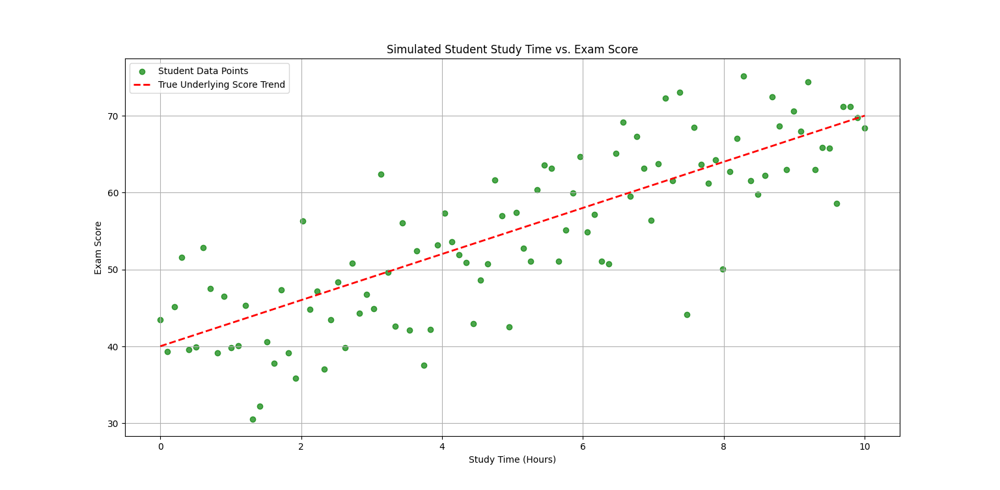
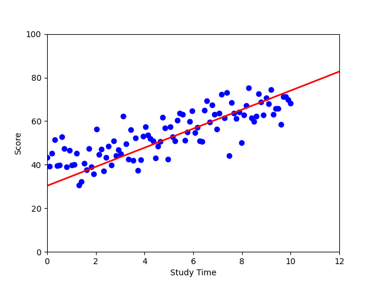

# Linear Regression from Scratch

## Overview
This project demonstrates how to implement linear regression from scratch using Python. Linear regression is a fundamental machine learning technique used to model the relationship between a dependent variable (target) and one or more independent variables (features) by fitting a straight line to the data.

---

## What is Linear Regression?
Linear regression aims to find the best-fitting straight line (regression line) through a set of data points. The equation for a simple linear regression (one feature) is:

$y = mx + b$

Where:
- $y$ is the predicted value (dependent variable)
- $x$ is the input feature (independent variable)
- $m$ is the slope of the line
- $b$ is the y-intercept

The goal is to find $m$ and $b$ that minimize the mean squared error (MSE) between the predicted values and the actual data:

$\text{MSE} = \frac{1}{n} \sum_{i=1}^n (y_i - (mx_i + b))^2$

---

## Data Explanation
The dataset simulates the relationship between study time (in hours) and exam scores for 100 students. The underlying true relationship is:

$\text{Score} = 3 \times \text{Study\_Time} + 40$

Random noise is added to make the data more realistic, simulating real-world variability.

**Sample of the data:**

| studytime | score |
|-----------|-------|
| 0.0       | 43.48 |
| 1.0       | 39.79 |
| ...       | ...   |
| 10.0      | 68.36 |

---

## Visual Explanation

Below is a sample plot of the data and the true underlying trend:



- **Green dots:** Simulated student data points
- **Red dashed line:** True underlying score trend

Below is the plot of final output after training loop


---

## Libraries Used

- **numpy**: For efficient numerical operations, generating random noise, and fitting the regression line using `np.polyfit`.
- **pandas**: For easy data manipulation and saving/loading CSV files with column names.
- **matplotlib**: For visualizing the data and regression line.

These libraries are chosen for their simplicity, speed, and popularity in the data science community.

---

## How to Run
1. Ensure you have Python 3.x installed.
2. Install the required libraries:
   ```bash
   pip install numpy pandas matplotlib
   ```
3. Run `data.py` to generate the dataset and visualize the true relationship.
4. Run `main.py` to load the data and perform linear regression.

---

## References
- [Wikipedia: Linear Regression](https://en.wikipedia.org/wiki/Linear_regression)
- [Scikit-learn: Linear Regression](https://scikit-learn.org/stable/modules/linear_model.html#ordinary-least-squares)

---

*Feel free to modify and experiment with the code to deepen your understanding of linear regression!*
